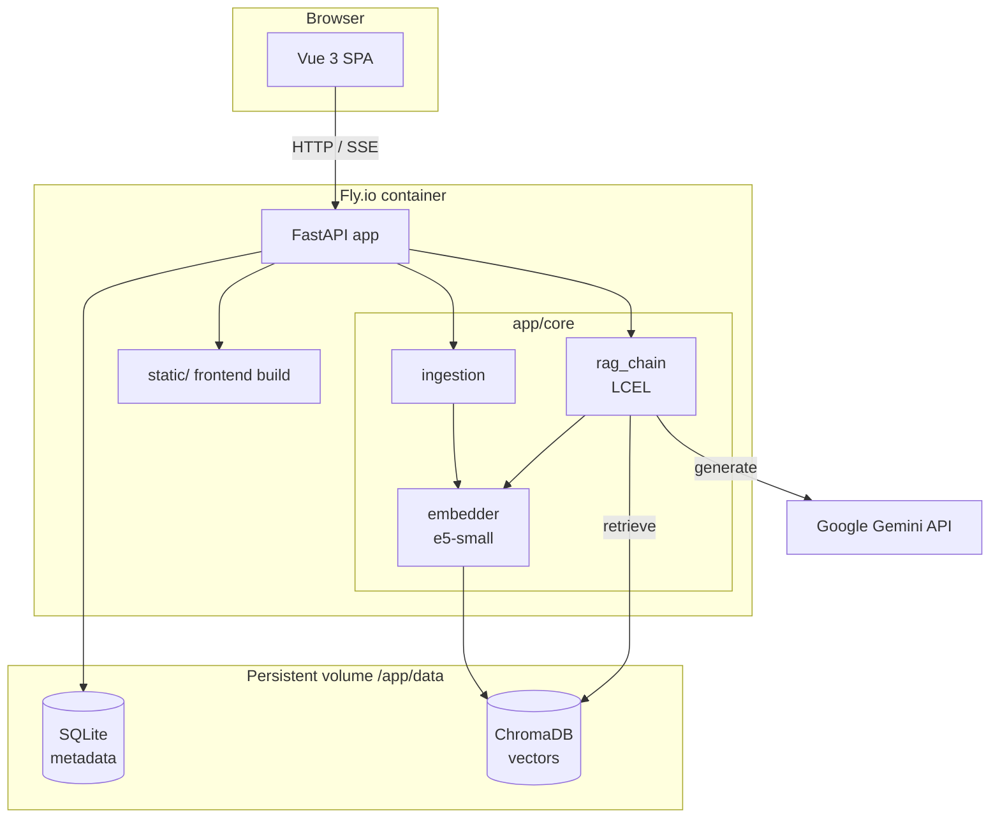
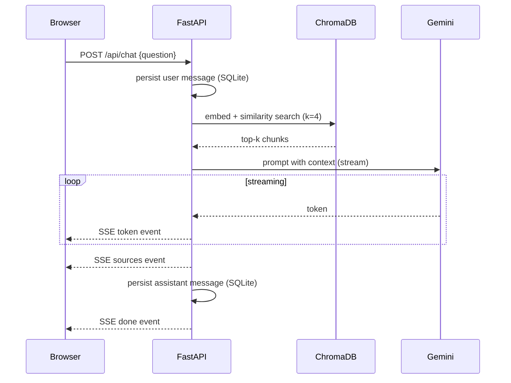

# Architecture

This document explains how the RAG chatbot is structured, how data flows through
the system, and the design decisions behind each component.

## Overview

The application is a single-container service. A FastAPI backend serves both the
JSON/SSE API and the compiled Vue 3 frontend as static files. Two storage layers
sit behind it: **SQLite** for metadata (documents, chat sessions, messages) and
**ChromaDB** for vector embeddings used in retrieval.



## Components

| Layer | Module | Responsibility |
|---|---|---|
| API | `app/api/documents.py` | Upload, list, delete documents |
| API | `app/api/chat.py` | Ask questions, stream answers (SSE), session history |
| Core | `app/core/ingestion.py` | Parse → chunk → embed → store in ChromaDB |
| Core | `app/core/embedder.py` | Lazy-loaded HuggingFace embedding model (singleton) |
| Core | `app/core/vectorstore.py` | ChromaDB client wrapper |
| Core | `app/core/llm.py` | Gemini chat model (singleton) |
| Core | `app/core/rag_chain.py` | LangChain LCEL chain wiring retriever + prompt + LLM |
| DB | `app/db/` | SQLAlchemy engine, session, ORM models |
| Schemas | `app/schemas/` | Pydantic request/response contracts |

## Data Flow

### 1. Document ingestion

When a user uploads a PDF/Markdown/text file (`POST /api/documents`):

1. The file type is validated against `ALLOWED_SUFFIXES` (`.pdf`, `.md`, `.txt`).
2. A `Document` row is created in SQLite with `status="processing"`.
3. The upload is written to a temp file and parsed by the matching loader
   (`PyPDFLoader` or `TextLoader`).
4. `RecursiveCharacterTextSplitter` splits the text into chunks
   (`chunk_size=500`, `chunk_overlap=50`).
5. Each chunk is tagged with metadata (`document_id`, `filename`, `chunk_index`),
   embedded with `intfloat/multilingual-e5-small`, and stored in ChromaDB.
6. The `Document` row is updated to `status="ready"` with the chunk count.

On failure the status is set to `error`; the temp file is always cleaned up.

### 2. Question answering (RAG)

When a user asks a question (`POST /api/chat`, returns an SSE stream):

1. A chat session is resolved (existing `session_id`) or created, and the user
   message is persisted to SQLite.
2. The question is embedded and the top-`k` (default 4) most similar chunks are
   retrieved from ChromaDB.
3. The LCEL chain composes `retriever → prompt → Gemini → StrOutputParser` and
   streams the answer token by token.
4. The stream emits typed SSE events in order:
   `session_id` → `token`* → `sources` → `done`.
5. After streaming completes, the full assistant message and its source
   references are written back to SQLite using a fresh DB session (the generator
   runs in a worker thread, so it cannot reuse the request-scoped session).



## Key Design Decisions

- **Local embedding model.** `multilingual-e5-small` runs on CPU inside the
  container, so embedding incurs no API cost and no per-request latency to an
  external service. It also supports Korean and English, matching the product's
  bilingual goal. The trade-off is memory: PyTorch + sentence-transformers push
  the container past 512 MB, so the Fly.io VM is provisioned with 2 GB RAM plus
  1 GB swap.

- **Singletons via `lru_cache`.** The embedding model and the LLM client are
  expensive to construct, so they are cached and lazily initialized on first use
  rather than at import time. This keeps startup fast and test imports cheap.

- **SSE over WebSockets.** Answers are one-directional server→client streams, so
  Server-Sent Events are simpler than WebSockets and work over plain HTTP. The
  backend uses a synchronous generator, which FastAPI runs in a thread pool.

- **Two storage layers.** ChromaDB owns vectors and similarity search; SQLite
  owns relational metadata and chat history. Keeping them separate lets each do
  what it is good at, and both persist to the same mounted volume so data
  survives container restarts.

- **Single-container deployment.** The Vue frontend is built at image-build time
  and served by FastAPI from `static/`. One container means one deploy, one
  health check, and no CORS in production.

## Storage Layout

Everything that must persist lives under the mounted volume at `/app/data`:

```
/app/data
├── sqlite/app.db     # documents, chat_sessions, chat_messages
└── chroma/           # ChromaDB collection (vectors + chunk metadata)
```
